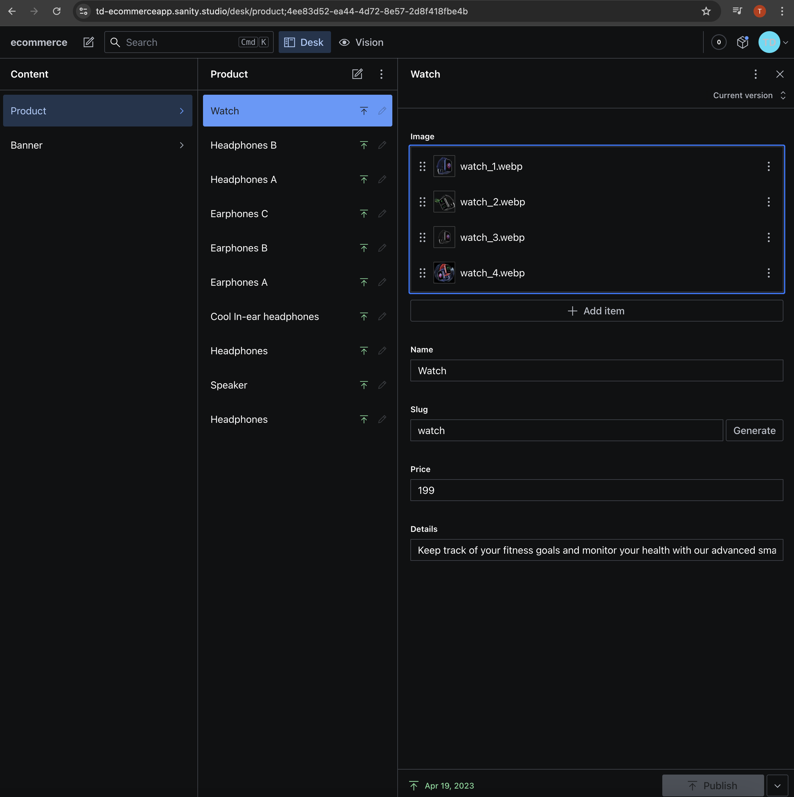
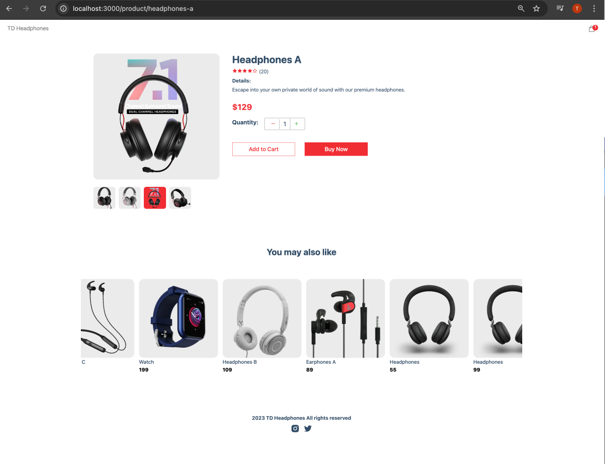
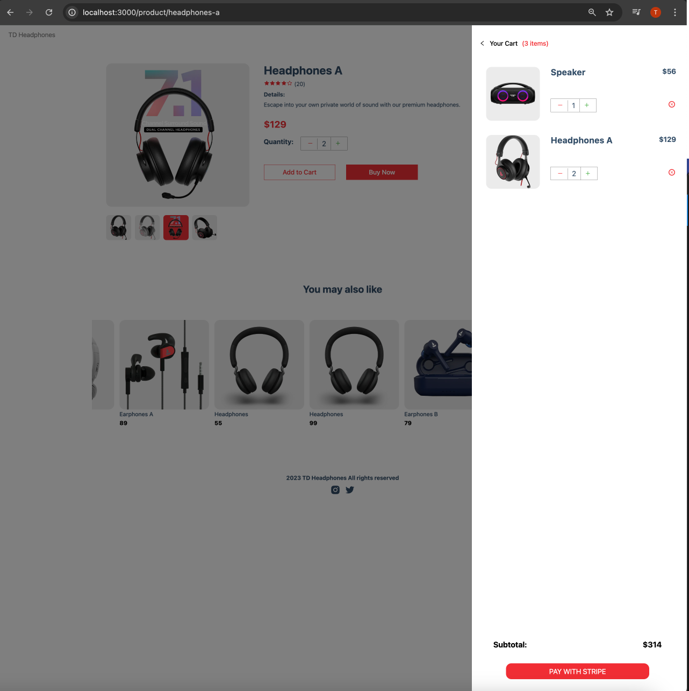
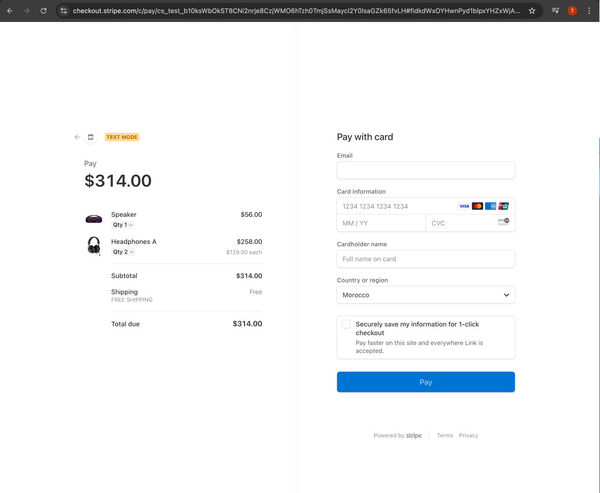
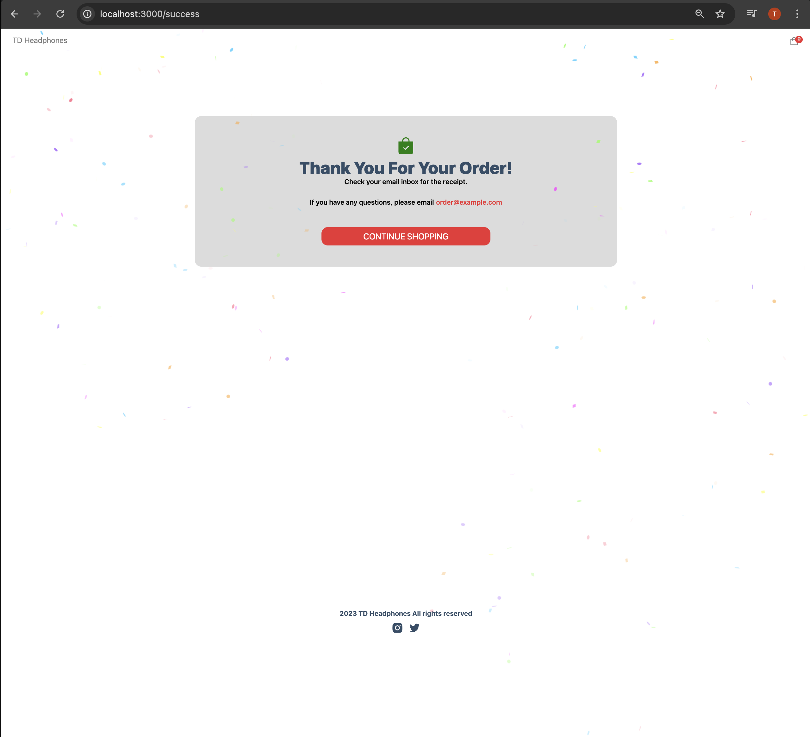

### Live Demo 

https://td-ecommerceapp.onrender.com/


# Setup

- Install [Node](https://nodejs.org/en/download/)
- Install [Git](https://git-scm.com/book/en/v2/Getting-Started-Installing-Git)
- Clone the repository `https://github.com/tddag/ecommerceApp`
- Install dependencies `npm install --legacy-peer-deps`
- Setup [Sanity](https://www.sanity.io/)
- Setup [Stripe](https://dashboard.stripe.com/login)
- Setup environment variables:
  - <table>
        <tr>
            <th>Variable</th>
            <th>Value</th>
            <th>Description</th>
        </tr>
        <tr>
            <td>NEXT_PUBLIC_SANITY_TOKEN</td>
            <td>skyedYF7...</td>
            <td>Sanity Token</td>
        </tr>   
        <tr>
            <td>NEXT_PUBLIC_STRIPE_PUBLISHABLE_KEY</td>
            <td>pk_test_51My57....</td>
            <td>Stripe Public Key</td>
        </tr>   
        <tr>
            <td>STRIPE_SECRET_KEY</td>
            <td>sk_test_51My5....</td>
            <td>Stripe Secret Key</td>
        </tr>                                                   
    </table>
- Run the application `npm run dev`


# Functionalities
- Add new Product
    <table>
        <tr>
            <td></td>
        </tr>
    </table>
- Product Listing
    <table>
        <tr>
            <td></td>
        </tr>
    </table>
- Product Details, Add Product to Cart, Cart
    <table>
        <tr>
            <td></td>
            <td></td>
        </tr>
    </table>
- Stripe payment
    <table>
        <tr>
            <td></td>
            <td></td>
        </tr>
    </table>

# Test Data
- Test Stripe Credit Card Number `4242 4242 4242 4242`

# Technologies/Libraries
- NextJS: React Framework
- React: Web library
- Sanity: headless CMS (Content Management System)
- Stripe: payment APIs
- canvas-confetti: Confetti animations


This is a [Next.js](https://nextjs.org/) project bootstrapped with [`create-next-app`](https://github.com/vercel/next.js/tree/canary/packages/create-next-app).

## Getting Started

First, run the development server:

```bash
npm run dev
# or
yarn dev
```

Open [http://localhost:3000](http://localhost:3000) with your browser to see the result.

You can start editing the page by modifying `pages/index.js`. The page auto-updates as you edit the file.

[API routes](https://nextjs.org/docs/api-routes/introduction) can be accessed on [http://localhost:3000/api/hello](http://localhost:3000/api/hello). This endpoint can be edited in `pages/api/hello.js`.

The `pages/api` directory is mapped to `/api/*`. Files in this directory are treated as [API routes](https://nextjs.org/docs/api-routes/introduction) instead of React pages.

## Learn More

To learn more about Next.js, take a look at the following resources:

- [Next.js Documentation](https://nextjs.org/docs) - learn about Next.js features and API.
- [Learn Next.js](https://nextjs.org/learn) - an interactive Next.js tutorial.

You can check out [the Next.js GitHub repository](https://github.com/vercel/next.js/) - your feedback and contributions are welcome!

## Deploy on Vercel

The easiest way to deploy your Next.js app is to use the [Vercel Platform](https://vercel.com/new?utm_medium=default-template&filter=next.js&utm_source=create-next-app&utm_campaign=create-next-app-readme) from the creators of Next.js.

Check out our [Next.js deployment documentation](https://nextjs.org/docs/deployment) for more details.
